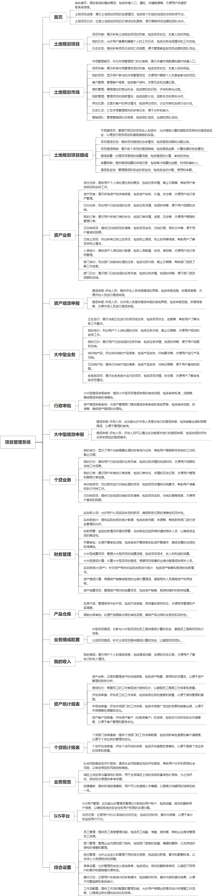

 

    
 

公司拥有上百套具有自主知识产权的软件系统，详情请查看码云首页或公司官网

 
<h1>政府项目管理系统</h1>

<a href="https://www.haishi.net.cn/">公司官网</a> ｜ <a href="https://www.haishi.net.cn/">在线体验</a>

 

## 系统介绍

项目管理系统是一款全方位的政府、企业大型项目管理工具，它集成了项目列表、项目排期、项目日志、部门管理、员工管理、客户管理等功能，实现了项目从启动到结项的全流程监控和管理。系统支持项目提成管理、绩效分配、工作流配置，同时提供实时的项目进度追踪、日志汇总、操作记录和提成奖金池监控，确保项目团队的高效协作和市场活动的有效管理
项目管理系统是一款全方位的政府、企业大型项目管理工具，它集成了项目列表、项目排期、项目日志、部门管理、员工管理、客户管理等功能，实现了项目从启动到结项的全流程监控和管理。系统支持项目提成管理、绩效分配、工作流配置，同时提供实时的项目进度追踪、日志汇总、操作记录和提成奖金池监控，确保项目团队的高效协作和市场活动的有效管理
本项目名称为项目管理系统，是一个涵盖大中型业务、个贷业务、资产业务、土规项目、土规市场、土规提成、财务模块、行政审批八个模块的综合性管理系统。
- 大中型业务、个贷业务、资产业务模块：涵盖了从业务开展、订单管理、任务执行、项目归档到提成结算的全流程管理。
- 土规项目和土规市场模块：包含项目管理、市场管理、客户管理、商机管理、回款管理等功能，旨在提高土规项目的市场拓展和项目管理效率。
- 土规提成模块：实现了土规项目提成计算、结算、奖金池管理等功能，方便进行绩效考核和激励。
- 财务模块：涵盖了实收款管理、开票审批、提成计算、结算等功能，实现了财务流程的自动化和规范化。
- 行政审批模块：主要功能是大中型提成申报审核和资产提成申报审核，实现了审批流程的线上化管理。
该系统适用于公司内部各个部门人员使用，不同角色拥有不同的功能权限，旨在提高公司整体的运营效率和管理水平。
                

## 系统功能介绍

### 系统包含终端说明

管理端（WEB）

| 序号 | 模块              | 模块说明 |
| ---- | ----------------- | -------- |
| 1    | ZF-PMS-FDC-SERVER | 服务端   |
| 2    | ZF-PMS-FDC-MANAGE | 管理端   |

### 系统功能结构

### 系统功能说明

- 大中型业务、个贷业务、资产业务流程管理
- 土规项目管理
- 土规市场管理
- 提成计算和结算
- 财务管理
- 行政审批

## 系统主要界面

## 系统技术说明

### 代码模块说明

| 序号 | 目录                       | 目录说明 |
| ---- | -------------------------- | -------- |
| 1    | ZF-PMS-FDC-SERVER/dao      | --       |
| 2    | ZF-PMS-FDC-SERVER/gen      | --       |
| 3    | ZF-PMS-FDC-SERVER/common   | --       |
| 4    | ZF-PMS-FDC-SERVER/biz-base | --       |
| 5    | ZF-PMS-FDC-SERVER/service  | --       |
| 6    | ZF-PMS-FDC-SERVER/domain   | --       |
| 7    | ZF-PMS-FDC-SERVER/.idea    | --       |

### 系统技术选型

#### 开发语言/框架

JAVA（JDK1.8）
前端框架：VUE2

#### 服务中间件

Nginx
Tomcat

#### 数据库

MySQL（5.7+）

#### 其他说明

无

## 系统演示/商用

请扫码添加客服微信获取演示地址和系统详细资料。

如果您想基于政府项目管理系统进行商业化交付或定制开发服务，我们提供有偿的技术服务支持，合作模式不限，欢迎沟通！

公司官网地址： <a href="https://www.haishi.net.cn/">https://www.haishi.net.cn</a>

联系客服获取专业回答。

## 使用须知

1、 本项目商用必须获得版权所有者的授权。

2、 未经允许本项目代码不允许二次出售。

